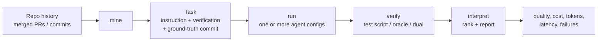
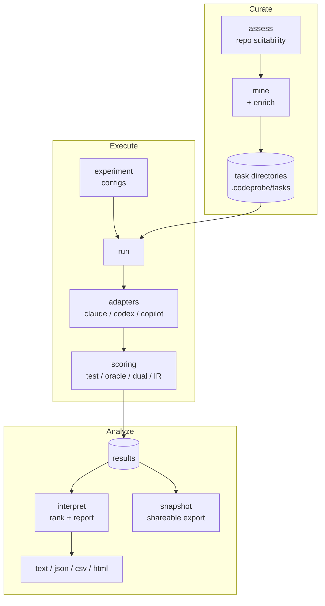

# CodeProbe

Turn your repository's own merged pull requests into coding-agent evaluations,
then measure the whole agent setup (model, tools, retrieval, cost, and harness)
against them, not just the model.

[](https://pypi.org/project/codeprobe/)
[](https://pypi.org/project/codeprobe/)
[](https://github.com/sjarmak/codeprobe/actions/workflows/ci.yml)
[](LICENSE)

> **Downstream field copy.** This repository is a maintained copy used for
> prospect and customer evaluations, and it does not publish anything. Upstream
> development and every release happen in
> [sjarmak/codeprobe](https://github.com/sjarmak/codeprobe): the `codeprobe`
> package on PyPI and the signed container images are built and signed there,
> and the release, image-publishing, and Pages workflows are disabled in this
> repository's Actions settings so a tag push here cannot publish. Install the
> CLI from PyPI as documented below, and start with
> [docs/POC_QUICKSTART.md](docs/POC_QUICKSTART.md).

```
$ codeprobe interpret ./compare

## Experiment: compare

### Rankings
1. sonnet — 82% pass rate, $1.94 total — recommended
2. haiku  — 61% pass rate, $0.38 total — cheaper, lower pass rate

### Per-Task Results
| Config | Task     | Score | Pass | Duration (s) | Cost ($) |
|--------|----------|-------|------|--------------|----------|
| sonnet | cb4bbd77 | 0.82  | Y    | 143.2        | 0.6100   |
| haiku  | cb4bbd77 | 0.40  | N    | 96.7         | 0.0900   |
```

CodeProbe mines real tasks from a repository's history, reconstructs the state
each change started from, runs one or more agent configurations against them,
and verifies the result. Point it at your private repositories to get an
evaluation set built from your own engineering work, or at any public repository
you can clone.

## Why CodeProbe?

Public coding benchmarks answer a different question than the one most teams
have. SWE-bench and HumanEval measure a model against a fixed, shared task set.
That leaves three gaps:

- **Representativeness.** A public benchmark's tasks may look nothing like your
  codebase, your conventions, or the changes your team actually ships.
- **Contamination.** Static, widely published task sets can leak into training
  data or be optimized against over time, so a rising score is hard to trust.
- **System vs. model.** A model benchmark scores the model. What ships to
  developers is a full system: a model plus a prompt, tools, retrieval, an MCP
  surface, and a harness. Those pieces move the outcome and a model-only number
  never sees them.

Merged pull requests are a different kind of ground truth. Each one is a real
task your team chose to do, with a known-good solution and, often, tests that
already encode acceptance. CodeProbe reconstructs tasks from that history so the
evaluation reflects your work and stays specific to your repository, which
reduces contamination risk compared with a shared public set.

## How it works



1. **Identify** candidate historical changes (merged PRs and merge commits),
   filtered by size, quality, and subsystem.
2. **Reconstruct** the repository state the change started from, in an isolated
   git worktree.
3. **Generate** an agent-ready task: an instruction plus a verification
   contract, with the known-good commit recorded as ground truth.
4. **Run** one or more agent configurations (agent, model, tools, preamble)
   against the task.
5. **Verify** the resulting change with a test script, an oracle answer, or both
   (dual verification).
6. **Record** the outcome: score, and where the agent backend supports it, cost,
   tokens, latency, tool-call counts, and failure category.

## Quick start

CodeProbe drives external coding agents, so install at least one. Claude Code is
the default target.

```bash
uv tool install codeprobe     # or: pipx install codeprobe / pip install codeprobe

cd /path/to/your/repo         # a full clone; shallow clones cannot be mined

codeprobe doctor --repo . --agent claude # check selected-agent readiness
codeprobe mine .              # reconstruct tasks from repo history
codeprobe run . --agent claude --max-cost-usd 5.00
codeprobe interpret .         # rank configs, print a report
```

`uv tool install` (or `pipx`) puts the CLI in its own environment and on your
PATH. A plain `pip install` into whichever interpreter happens to be active can
land codeprobe somewhere the `codeprobe` on your PATH is not, which shows up
later as `ModuleNotFoundError` from a command that looked installed.

Use `codeprobe doctor --repo . --agent copilot` when GitHub Copilot CLI is the
selected agent. Copilot CLI auth can come from `COPILOT_GITHUB_TOKEN`,
`GH_TOKEN`, `GITHUB_TOKEN`, or `gh auth login`. Omitting `--agent` auto-selects
the first usable supported path. Add `--private-ca /path/to/ca.pem` when your
enterprise proxy requires a custom CA.

`codeprobe run` refuses to start on a checkout with uncommitted changes (error
code `DIRTY_CHECKOUT`): every trial executes in an isolated worktree created
from HEAD, so uncommitted changes would be invisible to the agents. Commit or
stash first, or pass `--allow-dirty` to accept that agents only see HEAD.

`codeprobe run` also refuses to start outside a container (error code
`UNCONTAINED_REFUSED`): a run executes an autonomous agent with
`--dangerously-skip-permissions` plus mined third-party test/verifier scripts
directly on this machine, with the invoking user's full filesystem,
credential, and network access. Run inside a container (auto-detected), set
`CODEPROBE_SANDBOX=1` yourself if your containment is not auto-detected, or
pass `--uncontained` to accept host execution. codeprobe never sets
`CODEPROBE_SANDBOX` on its own.

Mined test/verifier scripts are third-party code. Prepare the released agent
and scoring images once with digest-pinned references; this works from an
installed wheel and does not require a source checkout or Dockerfiles:

```bash
codeprobe bootstrap \
  --agent-image 'registry.example.test/platform/codeprobe-agent@sha256:<agent-digest>' \
  --scoring-image 'registry.example.test/platform/codeprobe-scoring@sha256:<scoring-digest>'
```

The command supports Docker and Podman, verifies both expected registry
digests, and records immutable local image IDs. With an engine present but an
image missing, scoring refuses host execution unless the run was started with
`--uncontained`; the error directs the operator back to `codeprobe bootstrap`.
Private registries, proxies, private CAs, and offline OCI archives are covered
in [docs/oci_images.md](docs/oci_images.md).

The agent process is containerized the same way. With an engine on PATH and
the agent image prepared, `codeprobe run` proceeds on a bare host with no
`--uncontained` flag, and stderr discloses container mode. Each agent runs
inside a `--network=bridge` container (the agent needs the model API) whose
writable mounts are exactly the per-task worktree slot and, when parallel
session isolation is active, that slot's session config dir. The primary
checkout and the user's global config dir are never mounted; credentials
reach the container through the environment whitelist (`ANTHROPIC_API_KEY`,
`CLAUDE_CODE_OAUTH_TOKEN`, and similar). With an engine present but the agent
image missing, `codeprobe run` still refuses (`UNCONTAINED_REFUSED`) and
directs the operator back to the same bootstrap command.

To compare models, prompts, or tools rather than run a single agent, start with
`codeprobe init`, a guided "what do you want to learn?" wizard that builds the
comparison for you.

Prefer driving codeprobe through a coding agent instead? `codeprobe skills install`
puts the packaged skills (`codeprobe-mine`, `codeprobe-run`, `codeprobe-interpret`,
`codeprobe-calibrate`, `codeprobe-check-infra`) into `~/.claude/skills/`, where they
work against any repository you point them at; `--project` scopes them to the current
one instead. See [docs/workflows/with-agents.md](docs/workflows/with-agents.md) for
the workflow.
The copies are inert files, so upgrading the package does not update them —
install stamps the destination with its version and `codeprobe doctor` warns
when the two drift apart. Re-run `codeprobe skills install` after upgrading.

Prerequisites: CPython 3.11–3.13, Git 2.34+, and one coding agent. The support
status below applies to repository-edit comparisons.

| Agent          | Status      | Install                                          | Auth                            |
| -------------- | ----------- | ------------------------------------------------ | ------------------------------- |
| Claude Code    | Supported   | [claude.ai/download](https://claude.ai/download) | `ANTHROPIC_API_KEY`             |
| GitHub Copilot | Preview     | `npm install -g @github/copilot-cli` (>= 1.0.4)  | `COPILOT_GITHUB_TOKEN`, `GH_TOKEN`, `GITHUB_TOKEN`, or `gh auth login` |
| Codex          | Unsupported | ships with `codeprobe` (uses the OpenAI API)     | `OPENAI_API_KEY`                |

The Anthropic and OpenAI SDKs are core dependencies, so both are installed with
the base package. Mining enrichment and LLM scoring auto-detect a backend in
this order: Anthropic SDK, OpenAI SDK, then the Claude CLI, selected by which
API key is present. Override with `CODEPROBE_LLM_BACKEND`. With no key, mining
falls back to template instructions and `assess` falls back to heuristic
scoring.

## A merged PR becomes an evaluation

The full flow, with real commands and real output, is in
[docs/example-walkthrough.md](docs/example-walkthrough.md). The short version:

**Input.** A merged change in repo history, for example CodeProbe's own merge
commit `cb4bbd77` (the "Agent-friendly CLI" work).

**Mine it.** `codeprobe mine . --goal quality --count 1` produces a task
directory whose `metadata.json` records the provenance and verification:

```json
{
  "id": "cb4bbd77",
  "metadata": { "difficulty": "hard", "task_type": "sdlc_code_change",
                "ground_truth_commit": "cb4bbd77d64b...", "enrichment_source": "pr" },
  "verification": { "type": "test_script",
                    "command": "pytest tests/cli/test_envelope.py ...",
                    "reward_type": "continuous" }
}
```

The verification command is the set of tests the original PR touched. The agent
works against the pre-change state; the tests carry the expected outcome.

**Configure and run.** An experiment pins each setup under test:

```bash
codeprobe experiment add-config ./compare --label haiku  --agent claude --model claude-haiku-4-5-20251001
codeprobe experiment add-config ./compare --label sonnet --agent claude --model claude-sonnet-4-6
codeprobe experiment update-config ./compare --label sonnet --model claude-opus-4-1
codeprobe experiment remove-config ./compare --label haiku     # preview only
codeprobe experiment remove-config ./compare --label haiku --yes
codeprobe run ./compare --max-cost-usd 5.00
codeprobe interpret ./compare      # ranking table shown at the top of this README
```

For a fully offline check that needs no agent or API key, validate the committed
example tasks: `codeprobe validate examples/dual/sdlc/fix-import`.

## What CodeProbe evaluates

CodeProbe scores the complete configuration, and separates the signals that
usually get collapsed into a single number:

- **Task generation.** Reconstructs tasks from merged PRs/commits with a quality
  gate; `codeprobe assess` scores a repo's suitability first.
- **Agent execution.** Runs supported or preview agent adapters headless in an
  isolated worktree, with configurable timeout, parallelism, and repeats.
- **Correctness / verification.** Test-script, oracle-answer, checkpoint, and IR
  (file/symbol-overlap) scorers; dual verification combines a runnable test with
  an artifact answer and flags disagreement.
- **Model and harness configuration.** Each config pins agent, model, preamble,
  and MCP surface; results are compared per config, not per model.
- **Retrieval and tooling.** Code-search MCP servers attach per config, with
  source-isolation modes to force tool use and bias detectors that catch
  tautological tool wins.
- **Token, cost, and latency.** Adapters extract input/output/cache tokens,
  cost, and duration where the backend exposes them, tagged with a `cost_source`
  so estimated values are never reported as measured.
- **Regression and comparison.** Pairwise config deltas with confidence
  intervals; `interpret --regression` plots per-task score across commit history.

## Supported agents

Built-in adapters are selectable by name with `--agent`; availability is not
the same as enterprise support:

| Agent          | Status      | `--agent` | How it runs          | Telemetry                          |
| -------------- | ----------- | --------- | -------------------- | ---------------------------------- |
| Claude Code    | Supported   | `claude`  | headless `claude -p` | tokens, cost, tool calls, sessions |
| GitHub Copilot | Preview     | `copilot` | Copilot CLI          | tokens where exposed               |
| Codex          | Unsupported | `codex`   | OpenAI API           | tokens, cost (calculated)          |

The Codex adapter is quarantined for repository-edit comparisons. Custom and
unregistered adapters are unsupported unless an organization owns and tests
its complete execution path. See the
[enterprise compatibility matrix](docs/support.md) for the exact boundary.

Beyond the built-ins:

- **OpenAI-compatible endpoints** (Ollama, vLLM, Together, Groq, and similar)
  via `OpenAICompatAdapter`, wired programmatically with a `base_url` and a
  pricing table. Not registered under `--agent` by default.
- **Custom agents** via the `AgentAdapter` protocol
  (`src/codeprobe/adapters/protocol.py`), registered through the
  `codeprobe.agents` entry-point group. See [docs/adapters.md](docs/adapters.md).

Git hosts supported for mining: GitHub, GitLab, Bitbucket, Azure DevOps,
Gitea/Forgejo, and local repositories. PR/MR narrative fetch is GitHub-only
(it shells the `gh` CLI): GitHub repos get full PR narratives (bodies, linked
issues). GitLab, Bitbucket, Azure DevOps, Gitea/Forgejo, and self-hosted
remotes mine merge commits with `--narrative-source commits` — lower
narrative quality, since MR bodies and linked-issue context are not fetched.

## Methodology

**Task selection.** Mining reads full merge history and keeps merged PRs/commits
that pass a quality gate, filtered by `--min-files`, `--min-quality`, and
`--subsystem`. `--goal` picks the task shape: `quality` (SDLC code changes),
`navigation` (comprehension), `mcp` (org-scale, tool-benefit), or `general`.

**Historical state reconstruction.** Each task pins the base commit the change
started from and runs the agent in an isolated git worktree, so trials never
touch each other or the working tree.

**Task information vs. expected solution.** The instruction and verification
contract are what the agent sees. The known-good commit is recorded as ground
truth and kept separate, so the answer is not handed to the agent.

**Test / acceptance-criterion generation.** Verification reuses the tests the
original change touched, an oracle answer, or both. LLM enrichment (on by
default, 60s per-task timeout) rewrites weak instructions into a problem
statement plus acceptance criteria, and falls back to the template on timeout,
reporting the honest enriched split.

**Leakage and contamination risk.** Tasks built from your own history are
specific to your repository, which reduces the contamination and
optimize-against risk of a shared public benchmark; it does not eliminate it,
since the underlying commits may still be public or in training data. For
MCP-vs-no-MCP comparisons, multi-source consensus mining, a tool-independent AST
oracle, and aggregate-time bias detectors guard against ground truth that
tautologically favors one tool surface.

**Filtering unsuitable PRs.** Mining skips changes that are too small, low
quality, or lack a usable verifier; `codeprobe assess` scores whether a repo is
worth mining at all before you start.

**Repeatability.** Seeds, `--repeats`, saved mine profiles, and pinned base
commits make runs reproducible. `codeprobe check-infra` preflights capability
drift and credential TTLs before an offline run.

CodeProbe is beta software. Scores are only as good as the mined tasks and the
verifier behind them; treat a curated suite as something to review, not a
turnkey oracle.

## Architecture



Source layout lives under `src/codeprobe/`: `mining/` (curation), `adapters/`
(agent execution and telemetry), `core/` (isolation and scoring), `analysis/`
(ranking, statistics, reports), `assess/`, and `cli/`. See
[docs/onboarding/architecture_tour.md](docs/onboarding/architecture_tour.md) for
the diagrammed tour and [AGENTS.md](AGENTS.md) for the contributor contract.

## Use cases

- **Choose among agents or models.** A/B configs on the same tasks and rank by
  pass rate and cost.
- **Test retrieval or context systems.** Attach a code-search MCP server to one
  config, keep a baseline on another, and measure the delta with the isolation
  modes and bias detectors that keep the comparison honest.
- **Measure a harness change.** Vary preamble, timeout, turn limits, or tool
  surface and see whether the change moves quality or cost.
- **Build a repository-specific regression suite.** Mine once, rerun across
  commits, and plot per-task score over history with `interpret --regression`.
- **Evaluate cost-quality tradeoffs.** Every ranking carries cost and token
  data next to the score, with a budget cap via `--max-cost-usd`.
- **Validate an enterprise deployment.** Scope mining to the subsystems you care
  about, run against the exact agent stack you plan to ship, and export a
  shareable snapshot.

## Command reference

| Command                | Purpose                                              |
| ---------------------- | ---------------------------------------------------- |
| `codeprobe doctor`     | Check selected-agent readiness (auth, git, Python)   |
| `codeprobe assess`     | Score a codebase's suitability for benchmarking      |
| `codeprobe init`       | Interactive wizard: choose what to compare           |
| `codeprobe mine`       | Reconstruct eval tasks from merged PRs/commits       |
| `codeprobe probe`      | Generate fast micro-benchmark probes                 |
| `codeprobe experiment` | Manage comparison experiments (init, add-config)     |
| `codeprobe run`        | Execute tasks against an agent configuration         |
| `codeprobe interpret`  | Analyze results, rank configs, emit reports          |
| `codeprobe validate`   | Validate a task directory (offline)                  |
| `codeprobe snapshot`   | Create and verify shareable run snapshots            |
| `codeprobe oracle-check` | Compare an agent answer against oracle ground truth |
| `codeprobe purge`       | Delete cleartext run artifacts (retention lever)     |

Run `codeprobe --help` for the full command set (calibration, trace inspection,
ratings, preambles, and more), and see the
[docs/workflows/](docs/workflows/) guides (standard, cold-start, cross-repo) for
end-to-end recipes. Deep reference for MCP comparison experiments, consensus
mining, source-isolation modes, and aggregate bias detection lives in
[docs/workflows/](docs/workflows/) and [docs/adapters.md](docs/adapters.md).

## Limitations

- **Beta compatibility boundary.** Supported paths, schema read windows,
  deprecation notice, and upgrade rules are versioned in
  [Enterprise support and compatibility](docs/support.md). Preview and
  unsupported paths do not carry the same release-gate coverage.
- **Verifier-bound.** A task is only as trustworthy as its test or oracle. A
  weak verifier passes wrong solutions; mining rejects changes with no usable
  verifier, but cannot certify the ones it keeps.
- **History shape.** Repositories with squashed or vendored history, or with
  thin commit messages, yield weaker tasks. LLM enrichment helps but does not
  invent detail the history never had.
- **Full clone required.** Mining needs complete merge history; a
  `git clone --depth 1` cannot be mined.
- **Language matrix.** `codeprobe mine` supports **Python, Go, and
  JavaScript/TypeScript** repositories — test-command generation exists only
  for this matrix. Comprehension mining (`--goal navigation` / `--task-type
  architecture_comprehension`) is **Python-only** (import-graph static
  analysis); use `--goal quality` for Go and JS/TS repos. Any other primary
  language fails fast with `UNSUPPORTED_LANGUAGE` before any PR scanning
  starts.
- **Telemetry varies by backend.** Cost, tokens, and tool counts are extracted
  only where the agent exposes them; missing values are tagged `unavailable`,
  not estimated silently.
- **Not a public leaderboard.** CodeProbe produces a repository-specific result,
  not a number comparable across organizations.
- **Contamination is reduced, not removed.** Tasks are specific to your repo,
  but public commits may still appear in model training data.

## Development

```bash
git clone https://github.com/sjarmak/codeprobe
cd codeprobe
uv sync --extra dev          # or: pip install -e '.[dev]'
```

The `--extra dev` is required for test work. A bare `uv sync` omits pytest;
without `.venv/bin/pytest`, `uv run pytest` can fall back to a pytest executable
on `$PATH` and silently import `codeprobe` from a different checkout.

Reproduce the CI gates before handing off a change:

```bash
uv run ruff check src/ tests/ scripts/
uv run mypy src/codeprobe --strict-optional
uv run pytest tests/ -x --cov=src/codeprobe --cov-fail-under=80
uv run python3 scripts/lint_zfc.py src/codeprobe/ --allowlist scripts/lint_zfc.allowlist.toml
uv run pytest tests/lint/test_scorer_honesty.py -q
```

CI runs the same chain on Python 3.11, 3.12, and 3.13. See
[AGENTS.md](AGENTS.md) for the scoring, adapter, and ZFC contracts.

**Release.** Pushing a `v*` tag runs the test matrix, then builds and uploads to
PyPI (`.github/workflows/publish.yml`).

## Security and enterprise deployment

Security reporting lives in [SECURITY.md](SECURITY.md), and the tested platform
and upgrade boundary lives in
[Enterprise support and compatibility](docs/support.md). Enterprise reviewers
should start with
[docs/security/enterprise_deployment.md](docs/security/enterprise_deployment.md)
for the threat model, egress and mount matrices, credential flow, offline
behavior, local telemetry, retention, deletion, export, backup, and incident
response responsibilities.

## Data at rest & retention

Run artifacts are stored in cleartext on disk:

- Agent transcripts land under `.codeprobe/<experiment>/runs/<config>/<task>/agent_output.txt` (and `.codeprobe/<experiment>/runs/<config>/<task>/agent_error.txt`) with **secret-token redaction only**. API keys and auth tokens are scrubbed; source code is not.
- `.codeprobe/<experiment>/runs/trace.db` stores tool inputs and outputs with env-value and auth-pattern redaction only.
- Any proprietary source the agent prints (file contents it read, diffs it wrote) lands on disk verbatim.

Retention is operator-managed via `codeprobe purge`:

```bash
codeprobe purge .                       # dry run: list cleartext artifacts with sizes
codeprobe purge . --yes                 # delete runs/ artifacts (transcripts + trace.db)
codeprobe purge . --older-than 30 --yes # retention window: only artifacts >30 days old
codeprobe purge . --all --yes           # remove named experiments; clear root experiment contents
```

`purge` also sweeps stale `codeprobe-mcp-*.json` files from the system temp directory. It only ever deletes under `.codeprobe/` plus those temp files; it never touches your source tree and never runs git.
For the legacy root-level experiment layout, `--all` clears the pinned
`.codeprobe/` contents but retains the empty directory so a concurrent path
replacement cannot redirect deletion.

Snapshot redaction ([docs/SNAPSHOT_REDACTION.md](docs/SNAPSHOT_REDACTION.md)) applies **only to exports**. The local experiment tree is not redacted or encrypted at rest.

## License

Apache-2.0. See [LICENSE](LICENSE).

## Citation

```bibtex
@software{codeprobe,
  title  = {CodeProbe: repository-native evaluations for coding agents},
  author = {CodeProbe contributors},
  url    = {https://github.com/sjarmak/codeprobe},
  year   = {2026}
}
```
